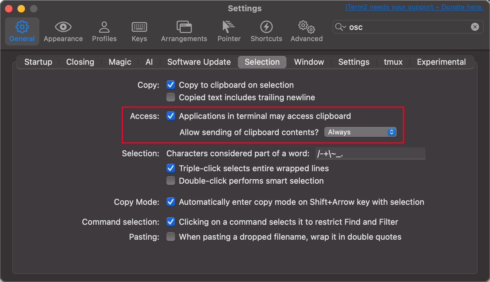

### Vim Config

- `basic.vim` - Common vim config (no clipboard)
- `local.vim` - Local clipboard (`set clipboard=unnamedplus`)
- `remote.vim` - Remote/Docker clipboard (OSC52)

### iTerm2 OSC52 Setup

To make `remote.vim` OSC52 clipboard work, enable the following setting in iTerm2:

